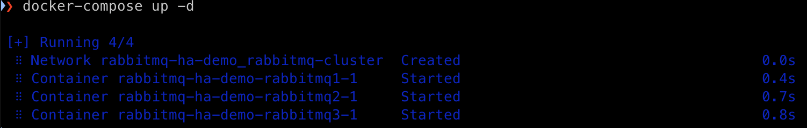
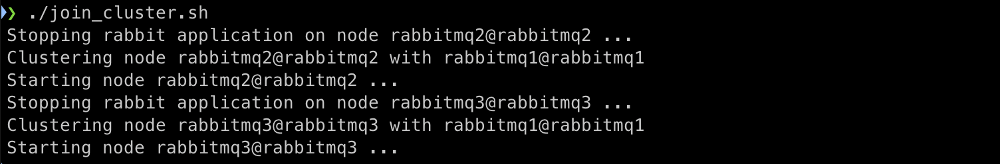
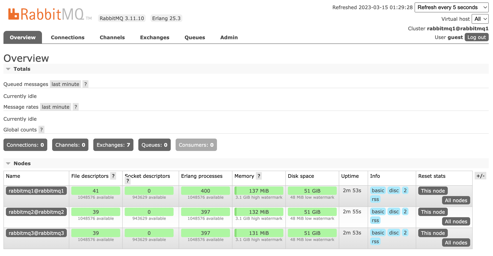

# RabbitMQ High Availability Cluster with Docker

This repository demonstrates how to set up a highly available RabbitMQ cluster using Docker Compose, with load balancing provided by HAProxy for both AMQP and Management Dashboard traffic.


## Prerequisites

- Docker: [Install Docker](https://docs.docker.com/get-docker/)
- Docker Compose: [Install Docker Compose](https://docs.docker.com/compose/install/)

## Setup

1. Clone this repository and navigate to the project directory:

```
git clone git@github.com:kisztof/rabbitmq-ha-demo.git
cd rabbitmq-ha-demo
```

2. Start the RabbitMQ cluster using Docker Compose:

```
docker-compose up -d
```


3. Wait a few seconds for the cluster to start, then join the nodes together by running the following commands:

```
./join_cluster.sh
```


4. Set up a policy to enable mirrored queues:

```
docker exec rabbitmq-ha-demo-rabbitmq1-1 rabbitmqctl set_policy ha-all ".*" '{"ha-mode":"all","ha-sync-mode":"automatic"}'
```

5. Access the RabbitMQ Management Dashboard:

Open your browser and navigate to http://127.0.0.1:15672/. Log in using the default credentials (username: guest, password: guest).



## Configuration
This setup includes:

- 3 RabbitMQ nodes with management plugin enabled
HAProxy as the load balancer for both AMQP (port 5672) and Management Dashboard (port 15672) traffic
- Docker Compose to easily manage the containers and their configuration
The docker-compose.yaml file defines the services, networks, and volumes for the RabbitMQ cluster and HAProxy load balancer. The haproxy.cfg file contains the configuration for the 
- HAProxy load balancer, including the frontends and backends for both AMQP and Management Dashboard traffic.

## Usage
Producers and consumers should connect to the RabbitMQ cluster through the HAProxy load balancer on port 5672. The load balancer will distribute the traffic evenly among the RabbitMQ nodes in a round-robin fashion.

Clients can access the RabbitMQ Management Dashboard via the load balancer's address and port 15672. HAProxy will also distribute the dashboard traffic among the RabbitMQ nodes in a round-robin manner.

## Troubleshooting
If you encounter any issues or errors, check the logs of the containers:

```
docker-compose logs -f
```

You can also inspect the individual containers:

```
docker-compose ps
```

```
docker-compose down
```

You now have a RabbitMQ cluster with high availability set up using Docker and Docker Compose. All queues created in this cluster will be mirrored across all nodes, providing fault tolerance and redundancy.

## Additional Resources:
- [RabbitMQ Official Website](https://www.rabbitmq.com/)
- [RabbitMQ Documentation](https://www.rabbitmq.com/documentation.html)
- [RabbitMQ Tutorials](https://www.rabbitmq.com/getstarted.html)
- [Docker Official Website](https://www.docker.com/)
- [Docker Compose Documentation](https://docs.docker.com/compose/)